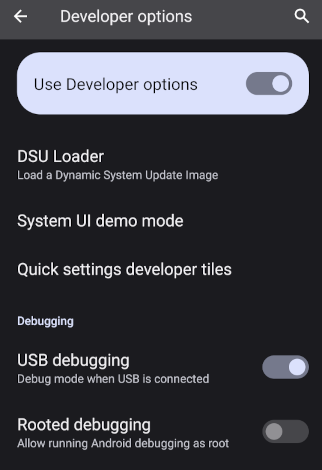
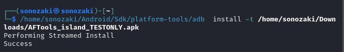
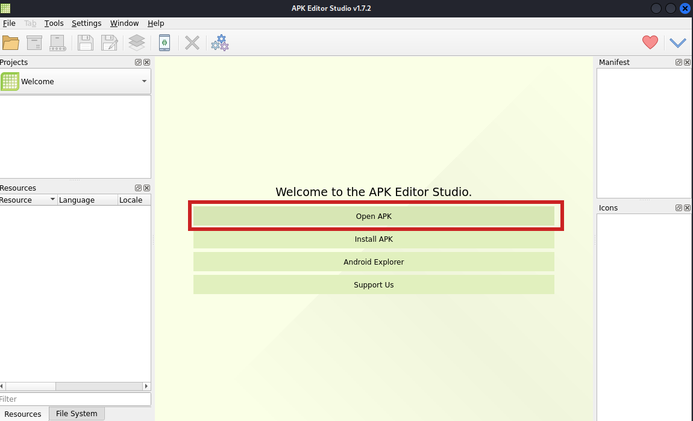
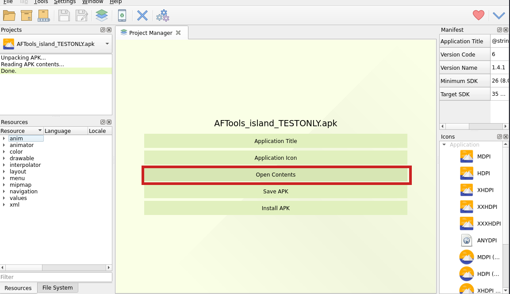
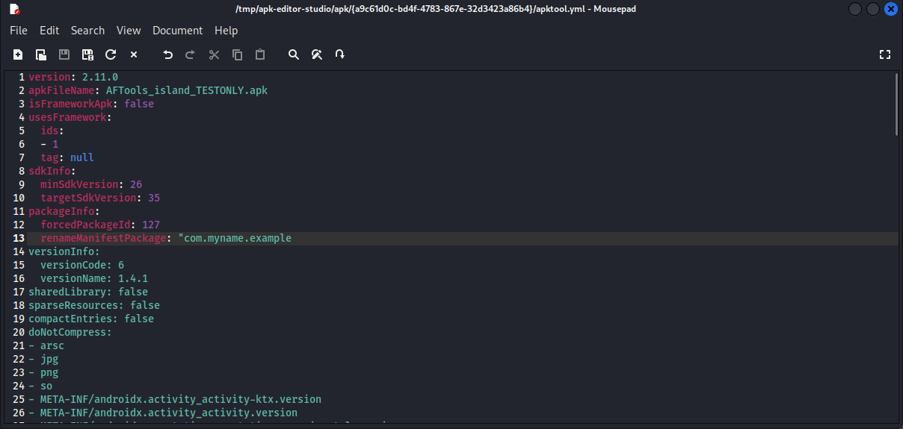
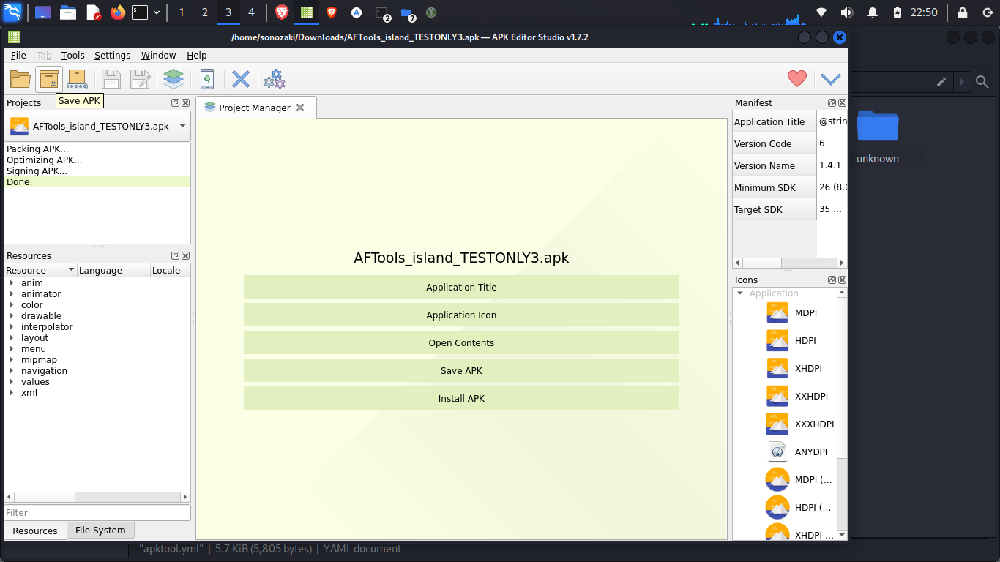
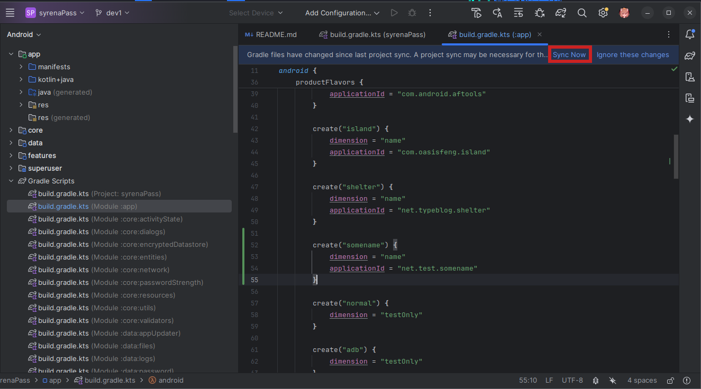
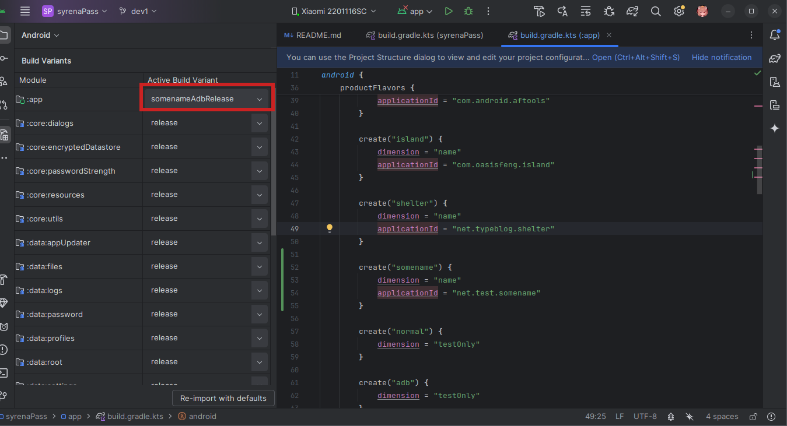

# Android AntiForensic Tools
[Readme на русском](./README_RU.md)

## Description

Android AntiForensic Tools is a free and open-source application designed to protect your personal data from a powerful adversary who can pressure you to unlock your device. Its purpose is to irreversibly destroy your sensitive data in the event of danger, to do so completely invisibly to the human eye, and, as far as possible, **to try** to do so imperceptibly to forensic experts. It allows you to wipe the device, user profiles, or personal files when a duress password is entered, a USB device is connected, device buttons are pressed several times in a row, or the wrong password is entered multiple times. The application offers additional options to protect your device from advanced adversaries: it can uninstall itself, run [TRIM](https://blog.elcomsoft.com/2025/06/what-trim-drat-and-dzat-really-mean-for-ssd-forensics/) after data deletion to prevent recovery of deleted data, disable logs to leave no traces of its actions, and disable safe boot mode.

Your data is protected with [Better Encrypted Datastore](https://github.com/bakad3v/BetterEncryptedDatastore).

## Threat models
Discussions about this app have repeatedly raised misunderstandings about the threat models it can and cannot protect users from. This app cannot protect you from all possible threats and **may actually make you more vulnerable to some**. Before using it, consider which scenario is most realistic for you:
* Your adversary isn't going to hack your phone using technical means, either due to a lack of technical equipment or because they're in a hurry. They will use only pressure, threats and physical force to obtain your device password. Such an adversary could be a corrupt police officer trying to force your password out of you immediately upon arrest, a thief, or an abusive partner. In this case Android Antiforensic Tools is your go-to - it's probably the best app for protecting against these types of threats.
* Your adversary could use Celebrite's UFED or other technical means to hack your phone. Such an adversary could be a customs officer at the border or a member of the security services. In this case, you should use [Graphene OS](https://grapheneos.org/) if it's possible. Using AntiForensic Tools with Graphene OS can help if you're lucky and manage to wipe the data before your phone is taken away from you (you can do it really fast by pressing power button several times in row), but it will probably fail to protect your device and could even make it more vulnerable in other case. Overall, using this app in the face of such a threat is a questionable choice. Perhaps you'd be better off using Graphene OS's built-in self-destruct option, but, unfortunately, wiping device data will be obvious to an adversary and that can make him angry.
* You're worried about a hacker attack on your phone, the installation of spyware like Pegasus. Most likely, to face such a threat, you'd need to be targeted by a powerful adversary. Don't use Antiforensic Tools; it will only make you more vulnerable to such threats. Use Graphene OS.

## Features and limitations
I was inspired to create this app by the [Wasted](https://github.com/x13a/Wasted) app by x13a. It allows you to factory reset the device when a duress password is entered, a USB device is connected, or other triggers are activated. Wasted is a big step forward for anti-forensics on Android devices, and in some situations, it can be useful, but Wasted has some limitations:
* Wiping device data is obvious to an adversary. That can provoke him and lead to unpredictable consequences for the user as described in this [blog post](https://t.me/tvoijazz/1026) (on russian).
* The protection can be bypassed by booting the device into safe mode, where user apps are disabled.
* The application destroys all user data.
* The application [does not work](https://github.com/x13a/Wasted/issues/73) on Android 14 and above. Wasted used [wipeData](https://developer.android.com/reference/android/app/admin/DevicePolicyManager#wipeData%28int,%20java.lang.CharSequence%29), which cannot be called from the primary user on Android 14+. To perform a hard reset on newer Android versions you must call [wipeDevice](https://developer.android.com/reference/android/app/admin/DevicePolicyManager#wipeDevice%28int%29) method, but it is only available to the application with device owner rights - and Wasted only uses admin privileges.

My app is designed to address these shortcomings. It allows wiping data on newer Android versions without root privileges by using Dhizuku, an app for handing over device owner rights to other apps. This app can prevent boot into safe mode. Most importantly, it enables **more stealthy** data destruction: instead of performing a full factory reset, the app can delete a single user profile or specific user files. Once all operations are complete, the application can delete itself.

There are limits to the stealthiness of data deletion. After data is removed, traces often remain in logs, caches, statistics, and other system places. It is nearly impossible to erase all such traces, and a determined adversary with full device access can detect them. Some traces are more or less harmless — you can plausibly explain a deleted Android profile — but other traces can reveal that data was recently deleted using this application and may increase an adversary’s interest in extracting the truth. I continually work to reduce these traces. The app includes some options to hide its presence, obscure traces of deleted data, and conceal the app’s role in data removal. However, the study of traces of deleted data is still far from complete.

Another disadvantage of the app is that its most advanced features, including self-destruction, require root permissions to function properly. Granting root permissions [increases](https://madaidans-insecurities.github.io/android.html) the attack surface and can make you more vulnerable to certain types of attacks. As an alternative to rooting your device, you can use the app with [Dhizuku](https://github.com/iamr0s/Dhizuku) and [Shizuku](https://github.com/pixincreate/Shizuku/), though using this methods may also introduce new attack vectors. However, features like self-destruction and TRIM may be less reliable due to limitations inherent in these apps.

**Warning: Dhizuku and Shizuku are not working well as of October 2025. This [version](https://github.com/iamr0s/Dhizuku/releases/tag/v2.10.1) of Dhizuku cannot trigger device data wipe until API 35 (Android 15); this [version](https://github.com/iamr0s/Dhizuku/releases/tag/v2.11) of Dhizuku can erase device data but does not work in BFU mode. This [version](https://github.com/pixincreate/Shizuku/releases/tag/shizuku-v13.5.4.r1082.d2ed7207-release) of Shizuku does not work with API 36 (Android 16); this [version](https://github.com/RikkaApps/Shizuku/releases/tag/v13.6.0) of Shizuku works with API 36, but its autostart feature does not work. Currently, Dhizuku and Shizuku are only fully functional on API 35 (Android 15).**

Despite using many available Android privileges, the app is limited by the OS itself. Custom OSes such as [GrapheneOS](https://grapheneos.org/) are better suited to withstand advanced adversaries and can patch security holes that this application cannot.

## Installation
In the Releases section you can download four versions of the app. Two of them can be installed as regular APKs; two must be installed via ADB or using root or Shizuku. If you enabled device admin rights, root rights and app self-destruction, please install the testOnly versions (instructions below); otherwise self-destruction will not work in BFU (before first unlock) mode. 

This app is disguised as other apps - [Island](https://github.com/oasisfeng/island) and [Shelter](https://gitea.angry.im/PeterCxy/Shelter). This app has nothing in common with those apps and use their package name, icon and name only for hiding apps traces. This is because even after uninstallation app's package name and maybe some other data will remain in some places of the system like packages.xml. It's needed to change apps package name so that after app uninstallation or self-destruction for an adversary examining the system it looks as if you uninstalled some other app from the device, not Android AntiForensic Tools. However, I can't guarantee that renaming the package will prevent traces of the application from being detected by an advanced adversary; further research is required to verify this. These apps were chosen for cloaking because they're open source, and you're unlikely to use both apps at the same time. If you have one of these installed on your device, install a version of Android AntiForensic Tools that masquerades as the other.

Ideally you should change the package name yourself before installing. When renaming, choose a package name used by an existing app that is not present on your device. A process for renaming the package will be described later.
### Apps versions
* AFTools_island_USUAL- a version of the app masquerading as the Island app. Can be installed without superuser rights.
* AFTools_shelter_USUAL - a version of the app masquerading as the Shelter app. Can be installed without superuser rights.
* AFTools_island_TESTONLY - a version of the app masquerading as the Island app. **Requires ADB or root for installation!**
* AFTools_shelter_TESTONLY - a version of the app masquerading as the Shelter app. **Requires ADB or root for installation!**"
### Installation of testOnly apps
#### Easiest way (root only)
1. Install the USUAL app version
2. Grant it root rights and **don't** give it admin rights
3. Select "App update center" in the menu
4. Select "install testonly version" option and click "install update"

#### Installation with root rights
1. Open the terminal on your Android device
2. Enter "su"
3. Enter the command "cat \<path to apk\> | pm install -t -S $(stat -c %s \<path to apk\>)". Sometimes you may need to enclose the path to the APK in quotes. Sometimes the simple command "pm install -t \<path to apk\>" may work.
4. If you install the new version of an app, enter the command "сat \<path to apk\> | pm install -t -r -S $(stat -c %s \<path to apk\>)".
5. After the update, restart the application accessibility service if it has stopped working
#### Installation via ADB
1. Download [SDK Platform tools](https://developer.android.com/tools/releases/platform-tools) on your PC
2. Unzip the archive
3. Download the version of the application that requires installation via ADB to your computer
4. On your mobile device, [unlock developer settings](https://developer.android.com/studio/debug/dev-options)
5. Open the developer settings and allow debugging via USB

6. Connect devices and allow USB debugging for your PC
7. Open the command prompt and enter the command \<path to platform-tools folder\>/adb[.exe] install -t \<path to apk file\>.

    
8. If you are installing a new version of an app, enter the command \<path to platform-tools folder\>/adb[.exe] install -t -r \<path to apk file\>.
9. After the update, restart the application accessibility service if it has stopped working
### Changing app's package name
#### Via Apktool
1. Install GUI client for apktool like [Apk editor studio](https://qwertycube.com/apk-editor-studio/download/). Install java if it's not installed.
2. Open the downloaded apk using client (File>Open APK)

3. Wait for the apk to decompile and click the large "open contents" button

4. The folder with app files will open. Edit file apktool.yml - find the option "renameManifestPackage" and change "null" to some package name

5. Close and save the file. You can also change the app title and application icon using the corresponding buttons in Apk Editor Studio.
6. You can optionally create your own signature for the application. Open Tools > Key Manager, select the "Custom KeyStore" checkbox, and fill in all required fields.
7. Now you can repack the project. Just click the "save apk" button.

8. Install the apk you created. If you repacked the testOnly version, follow the instructions above for installing testOnly apps.
#### Via Android Studio
1. Install [Android Studio](https://developer.android.com/studio).
2. [Clone the project](https://www.geeksforgeeks.org/how-to-clone-android-project-from-github-in-android-studio/) to yourself from github.
3. Open the build.gradle file for the app module
4. Add product flavor "somename" with dimension "name" and set the applicationId to the desired package name.

5. Sync project
6. Select build variant starting with "somename".

7. Go to the Build>Build Bundles/APKs>Build APKS or Build>Generate Signed Bundle/APK menu and [create an apk file](https://code.tutsplus.com/how-to-generate-apk-and-signed-apk-files-in-android-studio--cms-37927t).

**It is recommended to test the application at least once, especially the speed of data deletion along with self-destruction.**

## App usage
You can find full description of apps settings and recommendations for app usage in [github wiki](https://github.com/bakad3v/Android-AntiForensic-Tools/wiki/Android-AntiForensic-Tools-wiki).

## Known issues

### App doesn't react on duress password
Lock screens on different Android devices may use different package names. The application can receive text only from a number of predefined packages listed in the file [TriggerReceiverService.kt](https://github.com/bakad3v/Android-AntiForensic-Tools/blob/master/features/triggerReceivers/src/main/java/com/sonozaki/triggerreceivers/services/TriggerReceiverService.kt) in the constant PACKAGE_NAMES_INTERCEPTED. You can check the package name of your lock screen: connect your device to ADB, open the lock screen, and enter the command "[path-to]/adb[.exe] exec-out uiautomator dump /dev/tty | grep "android.widget.EditText"". You will see some items like this: package="com.android.keyguard". If your package name is different from those listed in the accessibility service configuration, the app will not respond to the password. Please report this in GitHub issues, and I will add your package name to the accessibility service configuration in the next version.

Please report all other issues in [github issues](https://github.com/bakad3v/Android-AntiForensic-Tools/issues) section.

## Acknowledgements
x13a, developer of the Wasted

iamr0s, developer of the Dhizuku

BinTianqi, developer of the [Owndroid](https://github.com/BinTianqi/OwnDroid) - he wrote code to work with Dhizuku in his app.

## Donate
You can support me using crypto.

XMR: 88Z5fsVK6FP4oVNjo2BrHydAEa5Y1gTPi5d7BN68sjVDZ9dTn8wPb89WmUxrxf3T37bRGSR5dekkU9aQ7j8ErWcBJ2GZojC

LTC: ltc1qtfhun6yzt0qlpa9d6s8gr2yd70sg0kx755u3se

BTC: bc1qn9a9eyy2vgrz8yvhk0654d63dt56pxhpn6q4xl

BTC lightning: dualwhorl66@walletofsatoshi.com
