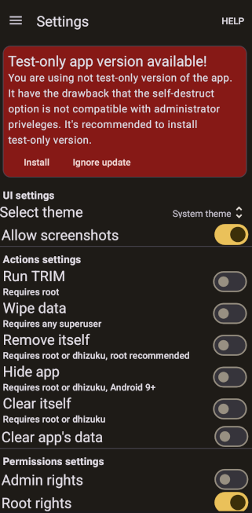

# Android AntiForensic Tools
[Readme на русском](./README_RU.md)

## Description

Android AntiForensic Tools is a free and open source application designed to protect your personal data from a powerful adversary that can put pressure on you and force you to unlock your device. Its purpose is to irreversibly destroy your sensitive data in the event of danger, to do so completely invisible to the human eye and, as far as possible, **to try** to do so imperceptibly to forensic experts. It allows you to wipe device, user profiles or personal files when a duress password is entered, a USB device is connected, device buttons are pressed several times in row or the wrong password is entered multiple times. An application offers additional options to protect your device from advanced adversaries: it can uninstall itself, run [TRIM](https://en.wikipedia.org/wiki/Trim_%28computing%29) after data deletion to prevent deleted data recovery, disable logs to leave no traces of it's actions and disable safe boot mode.

Your data is protected with [Better Encrypted Datastore](https://github.com/bakad3v/BetterEncryptedDatastore).

## Features and limitations
I was inspired to create this app by the [Wasted](https://github.com/x13a/Wasted) app by x13a. It allows you to factory reset the device when a duress password is entered, a USB is connected, or other triggers are triggered. This app is a big step forward for anti-forensics on Android devices, and in some situations it can be useful, but it has some limitations:
* Resetting device data is obvious to the adversary. This can make them angry and lead to unpredictable consequences for the user.
* The application has not been updated for 2 years.
* The protection provided by the application can be bypassed by booting the device into safe mode, where all user applications are disabled.
* The application destroys all user data.
* The application [does not work](https://github.com/x13a/Wasted/issues/73) on Android 14 and above. To reset the device, the [wipeData](https://developer.android.com/reference/android/app/admin/DevicePolicyManager#wipeData%28int,%20java.lang.CharSequence%29) method was used, which cannot be called from the primary user after the release of Android 14, which means that the device cannot be reset. Instead of wipeData, to perform a hard reset on newer versions of Android, you need to call the [wipeDevice](https://developer.android.com/reference/android/app/admin/DevicePolicyManager#wipeDevice%28int%29) method, but it is only available to the application with device owner rights - and Wasted only uses admin privileges.

My app is designed to address these shortcomings. It allows you to wipe all data on newer versions of Android without root privileges using Dhizuku, an app for handing over device owner rights to other apps. It allows you to prevent booting into safe mode using Dhizuku or root. Most importantly, it allows you to wipe data **relatively** stealthy. Instead of resetting the device, the application allows you to delete a single user profile or user files. Once all operations are completed, the application can delete itself.

Unfortunately, there are limits to the stealthiness of deleting data, although deleting data is still much more stealthy than resetting the device to factory defaults. After deleting data in various places in the system (logs, cache, statistics, etc.) remains a lot of evidence that this data existed. It is almost impossible to erase all these traces, and an advanced adversary with full access to the device will be able to detect them. Fortunately, some of these traces are harmless - you can make up whatever you want about a deleted Android profile. However, some traces allow to find out that you have recently deleted data using this application, that will make the adversary much more interested in extracting the truth from you. I try to fight with such traces. The app includes some additional options that will allow you to hide its existence on the device, traces of your data and role of an app in erasing data from your device. However, the study of traces of deleted data is still far from complete.

Another disadvantage of the app is that the most advanced features of the app, including the app self-destruction, require root permissions. Granting root privileges is usually accompanied by unlocking the bootloader, although some devices can [use root privileges with a locked bootloader](https://github.com/chenxiaolong/avbroot). Both root permissions and an unlocked bootloader (especially the last one) [make](https://madaidans-insecurities.github.io/android.html) the device more vulnerable to some other types of attacks. Instead of root permissions, you can use app with device owner rights via Dhizuku, but in that case the Android system will show a notification if the app attempts to self-destruct, making the self-destruct option virtually useless when used without root permissions. Without root permissions, you can hide the app from the launcher and erase its data, plus the app masquerades as other apps, but it will still be possible to reveal the presence of the app on the device.

Despite using almost all possible privileges in Android OS, app's possibilities are still limited by user's OS itself. Custom OS like GrapheneOS are capable to fight the most advanced adversaries and patch security holes that can't be patched by my application.

## Installation
In the "Releases" section, you can download 4 versions of the app. 2 of them can be installed as regular APKs, and 2 need to be installed via ADB or using root. If you have root rights, please install testonly versions using instructions below. Users without root rights or users with root rights using not testOnly version of the app will be not able to use device admin rights with self-destruction options in BFU (before first unlock) mode. I will fix it soon.

This app is disguised as other apps - [Island](https://github.com/oasisfeng/island) and [Shelter](https://gitea.angry.im/PeterCxy/Shelter). This app has nothing in common with those apps and use their package name, icon and name only for hiding apps traces. This is because even after uninstallation app's package name and maybe some other data will remain in some places of the system. It's needed to change apps package name so that after app uninstallation or self-destruction for an adversary examining the system it looks as if you uninstalled some other app from the device, not Android AntiForensic Tools. However, it is possible that even renaming the package will not prevent traces of the application from being detected by an advanced adversary; further research is required to verify this. These apps were chosen for cloaking because they're open source, and you're unlikely to use both apps at the same time. If you have one of these installed on your device, install a version of Android AntiForensic Tools that masquerades as the other.

Ideally, I recommend changing the package name yourself before installing. When renaming, select the package name used by an existing app that isn't on your device. The process of renaming a package will be described below.

### Apps versions
* AFTools_island_NON_ROOT_ONLY - a version of the app masquerading as the Island app. Can be installed without ADB or root rights, but **installation is not recommended.**
* AFTools_shelter_NON_ROOT_ONLY - a version of the app masquerading as the Shelter app. Can be installed without ADB or root rights, but **installation is not recommended.**
* AFTools_island_TESTONLY - a version of the app masquerading as the Island app. **Requires ADB or root for installation!**
* AFTools_shelter_TESTONLY - a version of the app masquerading as the Shelter app. **Requires ADB or root for installation!**"
### Installation of testOnly apps
#### Easiest way (root only)
1. Install NOT_RECOMMENDED app version
2. Give it root rights
3. You will see a notification at the top of the settings screen. Click "install" button and app will update itself to the testOnly version.

#### Installation with root rights
1. Open terminal on your android device
2. Enter "su"
3. Enter command "сat \<path to apk\> | pm install -t -S $(stat -c %s \<path to apk\>)". Sometimes you need to put path to apk in "" for some reason. Sometimes simple command "pm install -t \<path to apk\>" may work. 
4. If you install the new version of an app, enter the command "сat \<path to apk\> | pm install -t -r -S $(stat -c %s \<path to apk\>)".
5. After the update, restart the application accessibility service if it has stopped working
#### Installation via ADB
1. Download [SDK Platform tools](https://developer.android.com/tools/releases/platform-tools) on your PC
2. Unzip the archive
3. Download the version of the application that requires installation via ADB to your computer
4. On your mobile device, [unlock developer settings](https://developer.android.com/studio/debug/dev-options)
5. Open the developer settings and allow debugging via USB

6. Connect devices and allow USB debugging for your PC
7. Open the command prompt and enter the command \<path to platform-tools folder\>/adb[.exe] install -t \<path to apk file\>.

    
8. If you install the new version of an app, enter the command \<path to platform-tools folder\>/adb[.exe] install -t -r \<path to apk file\>.
9. After the update, restart the application accessibility service if it has stopped working
### Changing app's package name
#### Via Apktool
1. Install GUI client for apktool like [Apk editor studio](https://qwertycube.com/apk-editor-studio/download/). Install java if it's not installed.
2. Open downloaded apk using client (File>Open APK)

3. Wait for apk to decompile and click big "open contents" button

4. The folder with app files will open. Edit file apktool.yml - find option "renameManifestPackage" and change "null" to some package name

5. Close and save the file. You can also change app title and application icon using corresponding buttons in apk editor studio.
6. You can optionally create your own signature for the application. Open tools>key manager, select checkbox "Custom KeyStore" and fill all the fields with required data.
7. Now you can repack the project. Just click "save apk" button.

8. Install the apk you created. If you repacked testOnly version, follow the instructions above for installing testOnly apps.
#### Via Android Studio
1. Install [Android Studio](https://developer.android.com/studio).
2. [Clone the project](https://www.geeksforgeeks.org/how-to-clone-android-project-from-github-in-android-studio/) to yourself from github.
3. Open the build.gradle file for app module
4. Add product flavor "somename" with dimension "name" and applicationId equals to desired package name.

5. Sync project
6. Select build variant starting with "somename".

7. Go to the Build>Build Bundles/APKs>Build APKS or Build>Generate Signed Bundle/APK menu and [create an apk file](https://code.tutsplus.com/how-to-generate-apk-and-signed-apk-files-in-android-studio--cms-37927t).

**It is recommended to test the work of the application at least once, especially the speed of data deletion along with self-destruction.**

## App usage
You can find full description of apps settings and recommendations for app usage in [github wiki](https://github.com/bakad3v/Android-AntiForensic-Tools/wiki/Android-AntiForensic-Tools-wiki).

## Known issues

### App doesn't react on duress password
Lock screens on different android devices may use different package names. Application can receive text only from number of predefined packages, listed in file [accessibility_service_config.xml](app/src/main/res/xml/accessibility_service_config.xml). You can check package name of your lock screen: connect your device to ADB, open lock screen and enter command "[path-to]/adb[.exe] exec-out uiautomator dump /dev/tty | grep "android.widget.EditText"". You will see some items like this: package="com.android.keyguard". If your package name is different from ones listed in accessibility service configuration, app will not react on password. Please write about this in github issues, I will add your package name to accessibility service configuration in the new version.

Please report all other issues in [github issues](https://github.com/bakad3v/Android-AntiForensic-Tools/issues) section.

## Acknowledgements
x13a, developer of the Wasted

iamr0s, developer of the Dhizuku

BinTianqi, developer of the [Owndroid](https://github.com/BinTianqi/OwnDroid) - he wrote code to work with Dhizuku in his app.

## Donate
You can support me using crypto.

XMR: 88Z5fsVK6FP4oVNjo2BrHydAEa5Y1gTPi5d7BN68sjVDZ9dTn8wPb89WmUxrxf3T37bRGSR5dekkU9aQ7j8ErWcBJ2GZojC

LTC: ltc1qtfhun6yzt0qlpa9d6s8gr2yd70sg0kx755u3se

BTC: bc1qn9a9eyy2vgrz8yvhk0654d63dt56pxhpn6q4xl

BTC lightning: dualwhorl66@walletofsatoshi.com
