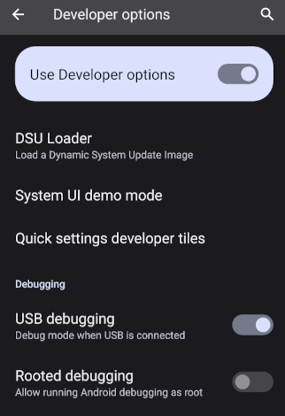
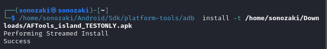
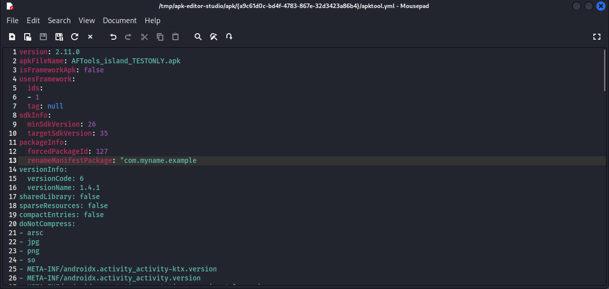
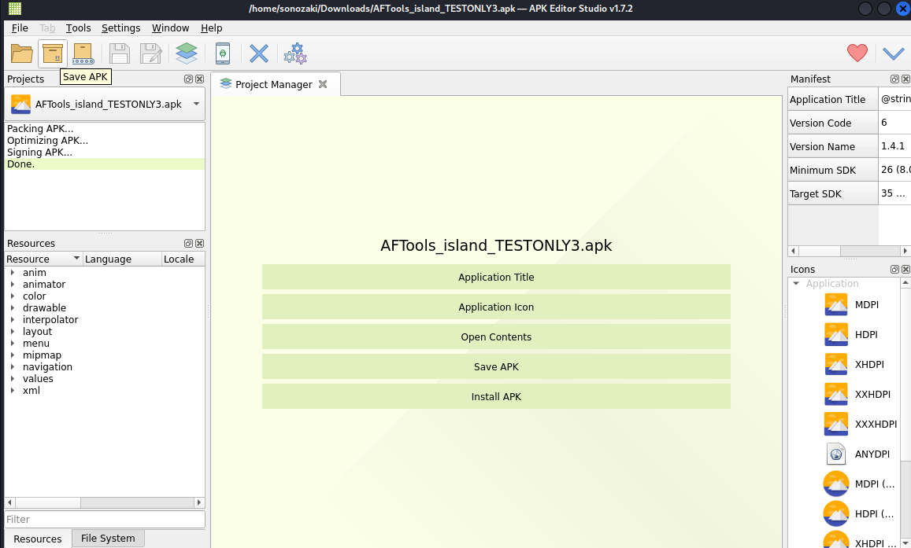
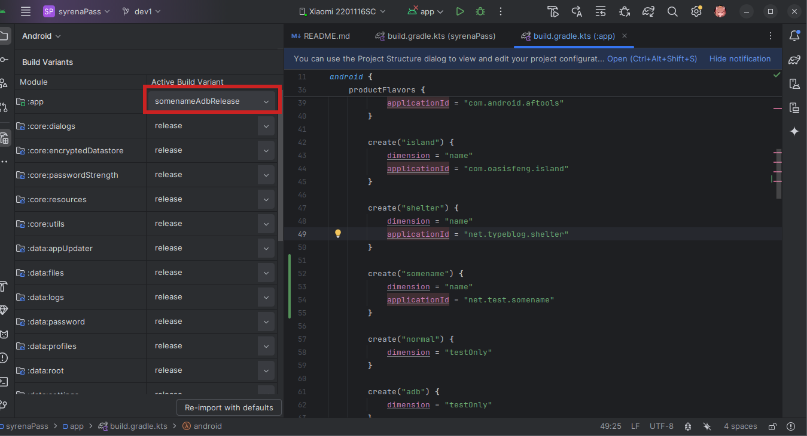

# Android AntiForensic Tools

## Описание приложения

Android AntiForensic Tools это бесплатное приложение с открытым исходным кодом, созданное, чтобы защитить ваши данные от могущественного злоумышленника, способного оказать на вас давление и заставить разблокировать устройство. Его цель - необратимо уничтожить ваши секретные данные в случае опасности, сделать это полностью незаметно для человеческого глаза и, насколько это возможно, **постараться** сделать это незаметно для экспертов по форенсике. Оно позволяет стереть данные устройства, профили пользователей или личные файлы при вводе фейкового пароля, подключении USB-устройства, многократном нажатии на кнопки или многократном вводе неправильного пароля. Приложение предлагает дополнительные опции для защиты вашего устройства от продвинутых злоумышленников: оно может удалить себя, запустить [TRIM](https://blog.elcomsoft.com/2025/06/what-trim-drat-and-dzat-really-mean-for-ssd-forensics/) после удаления данных, чтобы предотвратить восстановление удаленных данных, отключить логи, чтобы не оставить следов своих действий, запретить загрузку в безопасный режим и т.д.

Ваши данные защищены с помощью [Better Encrypted DataStore](https://github.com/bakad3v/BetterEncryptedDatastore).

## Возможности и ограничения
На создание этого приложения меня вдохновило приложение [Wasted](https://github.com/x13a/Wasted) от x13a. Оно позволяет сбросить устройство до заводских настроек при вводе фейкового пароля, подключении USB или при иных триггерах. Это приложение - большое достижение для антифоренсики на Android-устройствах, и в некоторых ситуациях оно может быть полезно, но у него есть недостатки:                     
* Сброс данных устройства очевиден для противника. Это может его разозлить и привести к непредвиденным последствиям для пользователя, о чём было написано в этом [посте](https://t.me/tvoijazz/1026).
* Защита, предоставляемая приложением, может быть обойдена с помощью загрузки устройства в безопасном режиме, в котором отключены все пользовательские приложения.
* Приложение удаляет все данные пользователя, в том числе и безобидные.
* Приложение [не работает](https://github.com/x13a/Wasted/issues/73) на Android 14 и выше. Для сброса устройства использовался метод [wipeData](https://developer.android.com/reference/android/app/admin/DevicePolicyManager#wipeData%28int,%20java.lang.CharSequence%29), который после выхода Android 14 нельзя  вызвать от имени главного пользователя, а значит нельзя осуществить и сброс устройства. Вместо wipeData для осуществления полного сброса на новых версиях Android нужно вызвать метод [wipeDevice](https://developer.android.com/reference/android/app/admin/DevicePolicyManager#wipeDevice%28int%29), но он доступен только приложению-владельцу устройства - а Wasted использует только права администора.

Моё приложение призвано исправить эти недостатки. Оно позволяет стереть все данные на новых версиях Android без root-прав с помощью Dhizuku, приложения для раздачи прав владельца устройства другим приложениям. Оно позволяет запретить загрузку в безопасном режиме с помощью Dhizuku или root. Но, что самое главное, оно позволяет удалять данные **относительно** незаметно. Вместо того, чтобы сбрасывать устройство, приложение позволяет удалить отдельный профиль пользователя или пользовательские файлы. После завершения всех операций приложение может удалить само себя.

К сожалению, у незаметности удаления данных есть ограничения, хотя удаление данных всё равно будет намного более незаметным, чем сброс устройства до заводских настроек. После удаления данных в разных местах системы (в логах, кэше, статистике и т.д.) остаётся множество свидетельств о том, что эти данные существовали. Стереть все эти следы практически невозможно, и продвинутый противник с полным доступом к устройству сможет их обнаружить. К счастью, некоторые из этих следов безобидны - вы можете выдумать всё что угодно об удалённом профиле Android. Однако некоторые следы позволяют установить, что вы стирали данные недавно с помощью этого приложения, что вызовет у противника куда больший интерес к тому, чтобы вытянуть из вас правду. Со следами такого рода я пытаюсь бороться. Приложение включает в себя некоторые дополнительные опции, которые позволят скрыть его существование на устройстве, следы ваших данных и  роль приложения в стирании данных с Вашего устройства. Тем не менее, изучение следов удалённых данных всё ещё далеко от завершения.

Ещё один недостаток приложения заключается в том, что наиболее продвинутые функции приложения, в том числе и удаление приложением самого себя, требуют рут-прав для того, чтобы надёжно работать. Наличие рут-прав на устройстве [делает](https://madaidans-insecurities.github.io/android.html) его более уязвимым к некоторым типам атак. Вместо рут-прав можно использовать  [Dhizuku](https://github.com/iamr0s/Dhizuku) и [Shizuku](https://github.com/pixincreate/Shizuku/), однако функции самоуничтожения или запуска TRIM могут работать менее надёжно из-за ограничений, которым обладают данные решения. 

Хотя данное приложение использует почти все доступные привелегии, доступные в рамках ОС Android, приложение всё ещё ограничено самой операционной системой пользователя. Кастомные ОС, такие как [GrapheneOS](https://grapheneos.org/), способны противостоять наиболее могущественным противникам и исправлять уязвимости, которые моё приложение исправить не в силах.

## Установка
В разделе "Releases" вы можете скачать 4 версии приложения. 2 из них можно установить как обычные APK-файлы, а 2 нужно устанавливать через ADB или используя root или Shizuku. Если вы предоставили приложению права администратора и рут права и настроили самоуничтожение приложения, то устанавливайте TEST_ONLY версию приложения, иначе самоуничтожение не сработает в режиме BFU (до первой разблокировки).

Это приложение замаскировано под другие приложения - [Island](https://github.com/oasisfeng/island) и [Shelter](https://gitea.angry.im/PeterCxy/Shelter). У него изменены имя пакета, иконка и название. Дело в том, что даже после удаления приложения его имя пакета, а может и другие его метаданные, остаются в системе, например в файле packages.xml. Поэтому нужно переименовать имя пакета приложения, чтобы после удаления или самоуничтожения приложения для противника, изучающего систему, всё выглядело так, как будто вы удалили с устройства какое-то другое приложение, а не Android AntiForensic Tools. Впрочем, не исключено, что даже переименование пакета не спасёт от обнаружения следов приложения продвинутым противником, требуются дальнейшие исследования для того, чтобы это проверить. Эти приложения были выбраны для маскировки, потому что они open source, и вы вряд ли будете использовать оба приложения одновременно. Если на вашем устройстве установлено одно из них, установите версию Android AntiForensic Tools, которая маскируется под другое.

В идеале я рекомендую перед установкой изменить имя пакета самостоятельно. При переименовании выберите имя пакета, используемое существующим приложением, которого нет на вашем устройстве. Процесс переименования пакета будет описан ниже.

### Описание версий приложения
* AFTools_island_USUAL - версия приложения, маскирующаяся под приложение Island. 
* AFTools_island_USUAL - версия приложения, маскирующаяся под приложение Shelter.
* AFTools_island_TESTONLY - версия приложения, маскирующаяся под приложение Island. **Требует ADB, Shizuku или root-прав для установки!**
* AFTools_shelter_TESTONLY - версия приложения, маскирующаяся под приложение Shelter. **Требует ADB, Shizuku или root-прав для установки!**
### Установка testOnly версий
#### Самый простой способ (нужны root права или Shizuku)
1. Установите версию приложения с названием USUAL
2. Дайте приложению рут-права или права Shizuku и **не давайте** ему права администратора
3. Выберите "App update center" в меню
4. Выберите "Install testonly version" и нажмите на кнопку "install update"

#### Установка с root-правами
1. Откройте терминал на своём устройстве
2. Введите "su"
3. Введите команду "сat \<путь к apk\> | pm install -t -S $(stat -c %s \<путь к apk\>)"
4. Если вы устанавливаете обновление приложения, введите команду "сat \<путь к apk\> | pm install -t -r -S $(stat -c %s \<путь к apk\>)".
5. После обновления перезапустите accessibility service приложения, если он перестал работать.
#### Установка через ADB
1. Скачайте на компьютер [SDK Platform tools](https://developer.android.com/tools/releases/platform-tools)
2. Распакуйте архив
3. Скачайте на компьютер версию приложения, требующую установку через ADB
4. На мобильном устройстве [разблокируйте настройки для разработчиков](https://developer.android.com/studio/debug/dev-options)
5. Откройте настройки для разработчиков и разрешите отладку через USB

6. Подключите устройство к компьютеру и разрешите отладку для этого устройства
7. Откройте командную строку и введите команду <путь к папке platform-tools>/adb[.exe] install -t <путь к apk файлу>. Иногда нужно поместить путь к apk в "". Иногда работает простая команда "pm install -t \<path to apk\>".
   
   
8. Если вы устанавливаете новую версию приложения, введите команду <путь к папке platform-tools>/adb[.exe] install -t -r <путь к apk файлу>.
9. После обновления перезапустите accessibility service приложения, если он перестал работать.
### Изменение имени пакета приложения
#### Через Apktool
1. Установите GUI клиент для apktool, например [Apk editor studio](https://qwertycube.com/apk-editor-studio/download/). Установите java, если это нужно.
2. Откройте скачанный apk с помощью клиента (File>Open APK)
   
3. Подождите декомпиляции apk. Нажмите на большую кнопку "open contents".
   
4. Вы откроете папку с файлами приложения. Откройте файл apktool.yml, найдите опцию "renameManifestPackage" и измените "null" на желаемое имя пакета.
   
   
5. Закройте и сохраните файл. Вы также можете поменять название приложения или его иконку с помощью соответствующих кнопок в меню Apk editor studio.
6. Вы можете по желанию создать свой ключ для подписи приложения. Для этого откройте tools>key manager, выберите чекбокс "Custom KeyStore" и заполните все необходимые поля требуемыми данными.
7. Теперь вы можете запаковать apk. Нажмите кнопку "save apk".
   
8. Установите созданный apk. Если вы перепаковывали testOnly версию приложения, то воспользуйтесь инструкцией выше для установки testOnly приложений.
#### Через Android Studio
1. Установите [Android Studio](https://developer.android.com/studio).
2. [Клонируйте проект](https://www.geeksforgeeks.org/how-to-clone-android-project-from-github-in-android-studio/) к себе с github.
3. Откройте файл build.gradle для модуля app
4. Добавьте flavor "somename" c dimension "name" и applicationId равном нужному имени пакета.
   
5. Синхронизируйте проект.
6. Выберите build variant, начинающийся на "somename"
   
7. Перейдите в меню Build>Build Bundles/APKs>Build APKS или Build>Generate Signed Bundle/APK и [создайте apk файл](https://code.tutsplus.com/how-to-generate-apk-and-signed-apk-files-in-android-studio--cms-37927t).
## Использование приложения
Вы можете найти полное описание настроек приложения и инструкции по использованию приложения в [github wiki](https://github.com/bakad3v/Android-AntiForensic-Tools/wiki/Android-AntiForensic-Tools-wiki).

## Известные проблемы

### Приложение не реагирует на фейковый пароль
Экраны блокировки на разных версиях Android могут иметь разные имена пакета. Приложение реагирует на ввод текста в текстовые поля с именами пакетов, заданными в [TriggerReceiverService.kt](https://github.com/bakad3v/Android-AntiForensic-Tools/blob/master/features/triggerReceivers/src/main/java/com/sonozaki/triggerreceivers/services/TriggerReceiverService.kt) в константе PACKAGE_NAMES_INTERCEPTED.. Вы можете проверить имя пакета у элементов своего экрана блокировки, подключив своё устройство к ADB, открыв экран блокировки и выполнив команду: "[path-to]/adb[.exe] exec-out uiautomator dump /dev/tty | grep "android.widget.EditText"". Вы можете увидеть текст вроде этого: package="com.android.keyguard". Если имя пакета у вас будет отличаться от пакетов, указанных в файле, то приложение не будет работать. Если у вас возникла такая ситуация, напишите об этом в github issues и имя пакета для вашей системы будет быстро добавлено в конфигурацию сервиса в новой версии приложения.

О других проблемах пишите в [github issues](https://github.com/bakad3v/Android-AntiForensic-Tools/issues).

## Благодарности
x13a, разработчик Wasted

iamr0s, разработчик Dhizuku

BinTianqi, разработчик [Owndroid](https://github.com/BinTianqi/OwnDroid) - он написал код для работы с Dhizuku в своём приложении.

## Поддержать разработчика
Вы можете поддержать меня в криптовалюте.

XMR: 88Z5fsVK6FP4oVNjo2BrHydAEa5Y1gTPi5d7BN68sjVDZ9dTn8wPb89WmUxrxf3T37bRGSR5dekkU9aQ7j8ErWcBJ2GZojC

LTC: ltc1qtfhun6yzt0qlpa9d6s8gr2yd70sg0kx755u3se

BTC: bc1qn9a9eyy2vgrz8yvhk0654d63dt56pxhpn6q4xl

BTC lightning: dualwhorl66@walletofsatoshi.com
